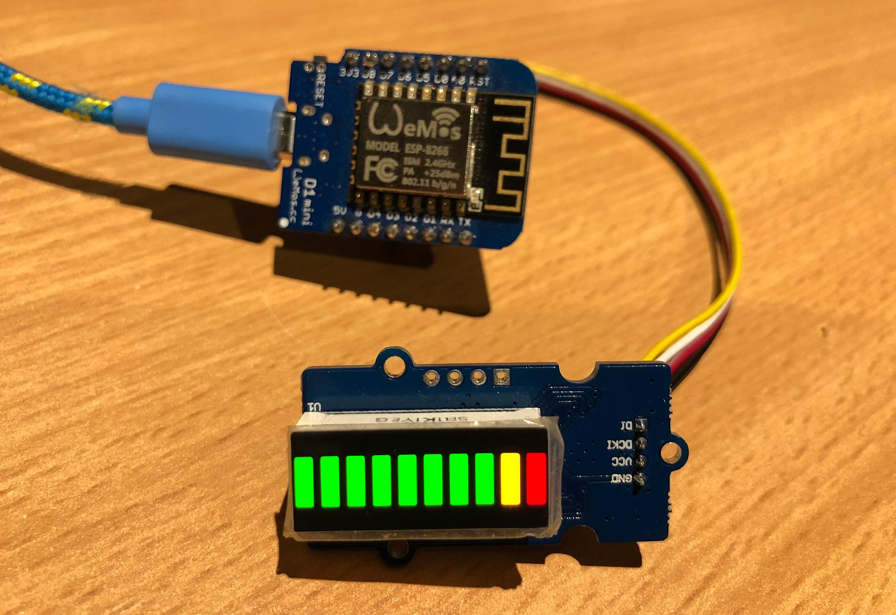

# MicroPython MY9221

A MicroPython library for 10 segment LED bar graph modules using the MY9221 LED driver.

For example, the [Grove - LED Bar module](http://wiki.seeed.cc/Grove-LED_Bar/)



## Examples

Copy the file to your device, using ampy, webrepl or compiling and deploying. eg.

```
$ ampy put my9221.py
```

**Basic usage**

```python
from my9221 import MY9221
from machine import Pin
ledbar = MY9221(di=Pin(4), dcki=Pin(5))

# all LEDS on, full brightness
ledbar.level(10)

# four LEDS on, half brightness
ledbar.level(4, 0x0F)

# first and last LED on
ledbar.bits(0b1000000001)
ledbar.bits(0x201)
ledbar.bits(513)

# alternating LEDs
ledbar.bits(0b0101010101)
ledbar.bits(0b1010101010)

# fade out LEDs
buf = bytearray([0,1,3,7,15,31,63,127,255,255])
ledbar.bytes(buf)

# reverse orientation, first LED is green
ledbar.reverse(True)
ledbar.level(1)

# normal orientation, first LED is red
ledbar.reverse(False)
ledbar.level(1)
```

For more detailed examples, see [my9221_test.py](my9221_test.py)

# Methods

Get or set the orientation.
The red LED normally position 1, and when reversed is position 10.
Once orientation has been set, all other methods respect the order.
```
reverse(val=None)
```

Illuminate a number of LEDs at a specific brightness.
A value of 5 would light half of the display.
```
level(val, brightness=255)
```

Illuminate LEDs, one bit per LED at a specific brightness.
Value can be 0-1023.
```
bits(val, brightness=255)
```

Use a bytearray, one byte per LED, to specify individual brightness for each LED.
```
bytes(buf)
```

## Parts

* [WeMos D1 Mini](https://www.aliexpress.com/store/product/D1-mini-Mini-NodeMcu-4M-bytes-Lua-WIFI-Internet-of-Things-development-board-based-ESP8266/1331105_32529101036.html) $3.50 USD
* [Grove LED Bar](https://www.seeedstudio.com/Grove-LED-Bar-v2.0-p-2474.html) $3.90 USD
* [Grove Male Jumper Cable](https://www.seeedstudio.com/Grove-4-pin-Male-Jumper-to-Grove-4-pin-Conversion-Cable-%285-PCs-per-Pack%29-p-1565.html) $2.90 USD

## Connections

WeMos D1 Mini | Grove LED Bar
------------- | ---------------
D2 (GPIO4)    | DI (yellow)
D1 (GPIO5)    | DCKI (white)
3V3 (or 5V)   | VCC (red)
G             | GND (black)

## Links

* [WeMos D1 Mini](https://wiki.wemos.cc/products:d1:d1_mini)
* [micropython.org](http://micropython.org)
* [MY9221 datasheet](https://raw.githubusercontent.com/SeeedDocument/Grove-LED_Bar/master/res/MY9221_DS_1.0.pdf)
* [My Semi MY9221 product page](http://www.my-semi.com/content/products/product_mean.aspx?id=9)
* [BBC micro:bit version](https://github.com/mcauser/microbit-my9221)
* [Adafruit Ampy](https://learn.adafruit.com/micropython-basics-load-files-and-run-code/install-ampy)
* [micropython-my9221 on pypi](https://pypi.python.org/pypi/micropython-my9221/)

## License

Licensed under the [MIT License](http://opensource.org/licenses/MIT).
